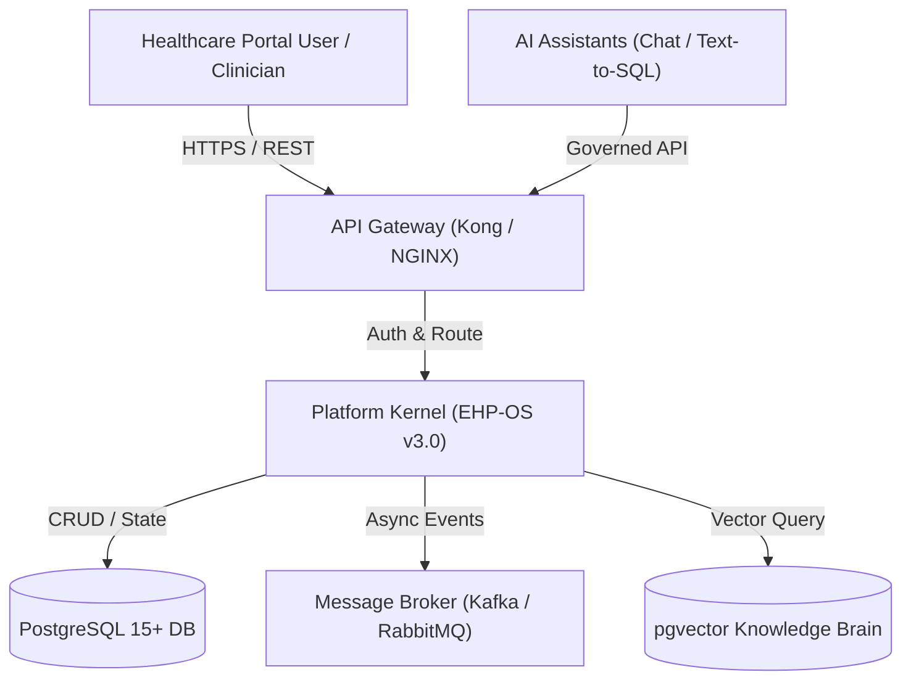

# System Context Diagram

```mermaid
graph TD
    User["Healthcare Portal User / Clinician"] -->|HTTPS / REST| Gateway["API Gateway (Kong / NGINX)"]
    AI["AI Assistants (Chat / Text-to-SQL)"] -->|Governed API| Gateway
    Gateway -->|Auth & Route| Kernel["Platform Kernel (EHP-OS v3.0)"]
    Kernel -->|CRUD / State| DB[("PostgreSQL 15+ DB")]
    Kernel -->|Async Events| EventBus["Message Broker (Kafka / RabbitMQ)"]
    Kernel -->|Vector Query| VectorDB[("pgvector Knowledge Brain")]
```
