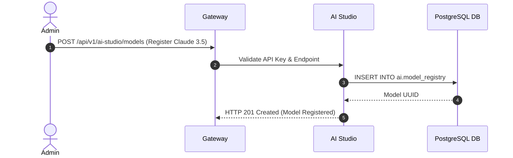

# Enterprise AI Studio — Implementation Specification

## Version 1.0.0

---

## 1. Purpose
The Enterprise AI Studio is a dedicated platform module where system administrators and AI engineers can register LLM providers (Anthropic, OpenAI, local Ollama / vLLM models), manage prompt templates, build RAG pipelines, configure agent tool registries, evaluate model performance, monitor API costs, and execute human-in-the-loop approvals.

---

## 2. Scope
Applies to all AI model integrations, prompt registries, Text-to-SQL models, RAG vector indexes, and AI security guardrails across HEMP.

---

## 3. Business Context
Making AI a configurable platform capability rather than hard-coded functionality allows healthcare administrators to swap underlying LLM models, update prompt versions, and enforce cost guardrails without software code deployments.

---

## 4. Functional Requirements
- **FR-AIS-01**: Model Registry & Provider Configuration (OpenAI, Anthropic Claude, Llama 3, Qwen 2.5).
- **FR-AIS-02**: Prompt Library Version Control & Playground Testing.
- **FR-AIS-03**: RAG Pipeline & Vector Index Management (`pgvector` HNSW indexes).
- **FR-AIS-04**: AI Token Usage & Cost Monitoring Dashboard.
- **FR-AIS-05**: Human-in-the-Loop Approval Queue for High-Risk AI Tool Executions.

---

## 5. Non-Functional Requirements
- **NFR-AIS-01**: LLM Gateway proxy routing latency overhead < 15ms.
- **NFR-AIS-02**: 100% audit logging of all LLM input prompts and model outputs.

---

## 6. Actors & Personas
- **AI Platform Administrator**: Registers model endpoints, sets token budgets, and reviews cost logs.
- **AI Prompt Engineer**: Authors and tests prompt versions in the AI Playground.
- **Compliance Officer**: Reviews AI audit logs and approves high-risk actions.

---

## 7. User Stories
- **US-AIS-01**: As an AI Administrator, I want to swap our Text-to-SQL model from GPT-4o to Anthropic Claude 3.5 Sonnet in the UI so that we can improve SQL accuracy without redeploying code.

---

## 8. UI Specifications & Wireframe Descriptions
- **Screen AIS-UI-01 (AI Model Registry Workbench)**:
  - *Navigation*: Administration > AI Studio > Model Registry
  - *Breadcrumbs*: Home / Administration / AI Studio / Models
  - *Wireframe*: Card grid displaying registered models (`Claude 3.5 Sonnet`, `Llama 3 70B`), API Endpoint, Active Status, Average Latency, and Monthly Token Spend ($). Button: `+ Register New Model`.

---

## 9. Navigation & Breadcrumb Maps
```
Home
└── Administration
    └── AI Studio
        ├── Model Registry (Home / Administration / AI Studio / Models)
        ├── Prompt Library (Home / Administration / AI Studio / Prompts)
        ├── RAG Pipelines (Home / Administration / AI Studio / RAG)
        └── Cost & Token Audit (Home / Administration / AI Studio / Usage)
```

---

## 10. Business Rules
- `AIS-BR-01`: High-cost LLM requests exceeding 16,000 output tokens MUST be pre-authorized or restricted by tier.

---

## 11. Validation Rules & RegEx Contracts
- Model Identifier: Lowercase string (`^[a-z0-9.-]+:[a-z0-9.-]+$`).

---

## 12. Workflow State Machine & Transitions
```
[DRAFT_PROMPT] ──(TEST_PLAYGROUND)──► [STAGED] ──(PROMOTE)──► [PRODUCTION]
```

---

## 13. Sequence Diagrams


---

## 14. Database Schema & DDL Links
Reference: [database/ddl/06_ai.sql](file:///c:/Users/affra/Documents/ETS/Enterprise%20Healthcare%20Management%20Platform/database/ddl/06_ai.sql)
Table: `ai.semantic_catalog`, `ai.prompt_template`.

---

## 15. Complete Data Dictionary
| Table | Column | Data Type | Nullable | Description |
|-------|--------|-----------|----------|-------------|
| `ai.prompt_template` | `prompt_id` | VARCHAR(64) | No | Primary Key |
| `ai.prompt_template` | `template_text` | TEXT | No | Prompt String with Variables |

---

## 16. API Specifications
- `POST /api/v1/ai-studio/models`: Register model provider.
- `GET /api/v1/ai-studio/prompts`: Fetch prompt versions.

---

## 17. Error Codes (RFC 7807 Compliant)
- `AIS-ERR-7001`: LLM Provider Timeout (`504 Gateway Timeout`).

---

## 18. Security & RBAC Matrix
- `system:aistudio:view`: View AI Studio configuration.
- `system:aistudio:admin`: Register models, prompts, and tool rules.

---

## 19. Immutable Audit Logging Specs
- Logs `MODEL_REGISTERED`, `PROMPT_PROMOTED_TO_PROD`, `TOKEN_BUDGET_EXCEEDED`.

---

## 20. Reporting & Dashboard Metrics
- LLM Token Usage & Expenditure Dashboard by Module.

---

## 21. AI Metadata & Tool Registry
- `register_llm_model(modelName: string, endpoint: string)`

---

## 22. Semantic Mapping & Text-to-SQL Catalog
- Business Definition: "Enterprise AI Studio, model registry, prompts, RAG indexes, token costs."

---

## 23. Performance & Latency Targets
- AI Gateway Proxy Overhead: < 15ms.

---

## 24. Test Cases & Acceptance Criteria
- `TC-AIS-001`: Registering valid LLM endpoint returns HTTP 201 and enables prompt testing.

---

## 25. Acceptance Criteria Matrix
- Unauthorized users attempting model registration receive `AIS-ERR-4003`.

---

## 26. Future Enhancements
- Automated A/B prompt evaluation comparing accuracy scores across model versions.

---

## 27. Cross References
- [04_AI_Architecture.md](file:///c:/Users/affra/Documents/ETS/Enterprise%20Healthcare%20Management%20Platform/specifications/04_AI_Architecture.md)

---

## 28. Revision History
- **v1.0.0** (2026-08-05): Initial Production-Ready Specification release.
