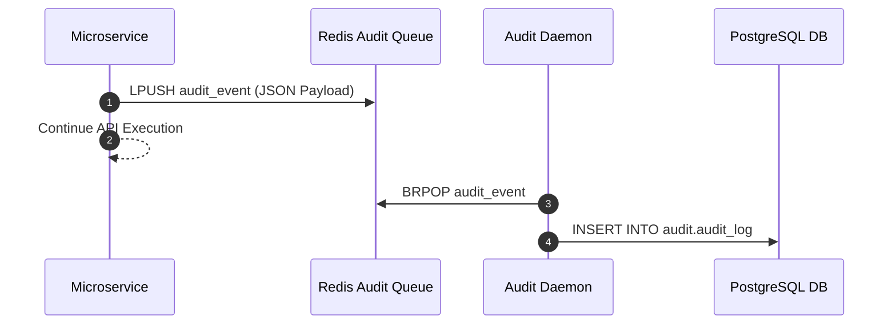

# Audit Engine — Implementation Specification

## Version 1.0.0

---

## 1. Purpose
The Audit Engine is the platform security service writing immutable, partitioned audit logs (`audit.audit_log`) for all data access, privilege modifications, transaction writes, and AI assistant actions across HEMP.

---

## 2. Scope
Applies to HIPAA compliance auditing, PHI access tracking, security breach investigations, and AI interaction logging.

---

## 3. Business Context
HIPAA regulations mandate complete, tamper-proof audit trails for all Protected Health Information (PHI) access and modifications.

---

## 4. Functional Requirements
- **FR-AUD-01**: Immutable Transaction Audit Logging (`who`, `when`, `action`, `old_state`, `new_state`, `ip_address`).
- **FR-AUD-02**: Partitioned log storage by calendar year (`audit_log_2026`).
- **FR-AUD-03**: Asynchronous batch writing via Redis buffer to prevent performance degradation on main API threads.

---

## 5. Non-Functional Requirements
- **NFR-AUD-01**: Zero data loss for audit events.
- **NFR-AUD-02**: Audit log write latency overhead < 2ms (Async).

---

## 6. Actors & Personas
- **Compliance Auditor**: Queries audit logs to conduct security reviews.
- **Platform Security Engine**: Automatically dispatches audit events.

---

## 7. User Stories
- **US-AUD-01**: As an Auditor, I want to view all access events for a specific patient's chart so that I can verify HIPAA compliance.

---

## 8. UI Specifications & Wireframe Descriptions
- **Screen AUD-UI-01 (Audit Trail Log Viewer)**:
  - *Navigation*: Security > Audit > Log Viewer
  - *Wireframe*: Search filter by User ID, Entity ID, Action Type, Timestamp Range. Data grid displaying Audit ID, Timestamp, User, Action, Entity, IP Address, Details (`View Diff Modal`).

---

## 9. Navigation & Breadcrumb Maps
```
Home
└── Security
    └── Audit Log Viewer (Home / Security / Audit)
```

---

## 10. Business Rules
- `AUD-BR-01`: Audit log records CANNOT be updated or deleted by any application user or database role (`UPDATE` and `DELETE` triggers revoked).

---

## 11. Validation Rules & RegEx Contracts
- `traceId`: `^[a-f0-9-]{36}$`

---

## 12. Workflow State Machine & Transitions
```
[LOGGED] ──(ARCHIVE_AFTER_7_YEARS)──► [ARCHIVED]
```

---

## 13. Sequence Diagrams


---

## 14. Database Schema & DDL Links
Reference: [database/ddl/07_audit.sql](file:///c:/Users/affra/Documents/ETS/Enterprise%20Healthcare%20Management%20Platform/database/ddl/07_audit.sql)
Table: `audit.audit_log`.

---

## 15. Complete Data Dictionary
| Table | Column | Data Type | Nullable | Description |
|-------|--------|-----------|----------|-------------|
| `audit.audit_log` | `audit_id` | BIGSERIAL | No | Primary Key |
| `audit.audit_log` | `action_type` | VARCHAR(32) | No | Event Action Type |

---

## 16. API Specifications
- `GET /api/v1/audit/logs`: Query audit trail records.

---

## 17. Error Codes (RFC 7807 Compliant)
- `AUD-ERR-4001`: Audit Buffer Full Warning (`503 Service Unavailable`).

---

## 18. Security & RBAC Matrix
- `security:audit:view`: View audit logs.

---

## 19. Immutable Audit Logging Specs
- Self-audits: `AUDIT_SEARCH_PERFORMED`, `AUDIT_LOG_EXPORTED`.

---

## 20. Reporting & Dashboard Metrics
- Security Event Summary & PHI Access Volume.

---

## 21. AI Metadata & Tool Registry
- `query_audit_trail(userId?: string, entityId?: string)`

---

## 22. Semantic Mapping & Text-to-SQL Catalog
- Business Definition: "Immutable audit logs, HIPAA access records, security events."

---

## 23. Performance & Latency Targets
- Audit Search Query: < 100ms.

---

## 24. Test Cases & Acceptance Criteria
- `TC-AUD-001`: Updating user role writes audit event containing previous and new role states.

---

## 25. Acceptance Criteria Matrix
- Database prevents `DELETE` statements on `audit.audit_log`.

---

## 26. Future Enhancements
- Immutable WORM (Write Once Read Many) cloud storage archiving.

---

## 27. Cross References
- [13_Audit_Framework.md](file:///c:/Users/affra/Documents/ETS/Enterprise%20Healthcare%20Management%20Platform/specifications/13_Audit_Framework.md)

---

## 28. Revision History
- **v1.0.0** (2026-08-05): Production-Ready Implementation Specification release.
