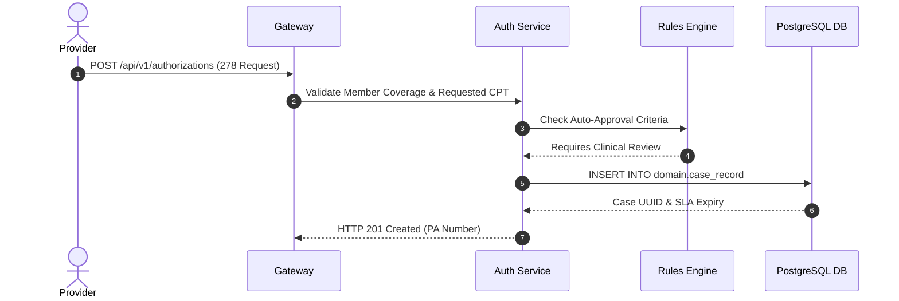

# Service Prior Authorization — Implementation Specification

## Version 1.0.0

---

## 1. Purpose
The Service Authorization Module provides Prior Authorization (PA) intake (EDI 278 & Portal), clinical necessity reviews, utilization management case tracking, peer-to-peer consult scheduling, and approval/denial decision dispatch across HEMP.

---

## 2. Scope
Applies to inpatient admissions, specialized surgeries, high-cost pharmaceuticals, durable medical equipment (DME), and out-of-network referrals.

---

## 3. Business Context
Prior authorization ensures rendered services are medically necessary before high-cost treatments occur, reducing unnecessary health plan expenses while guaranteeing quality care for enrollees.

---

## 4. Functional Requirements
- **FR-AUTH-01**: Urgent and standard Prior Authorization intake via EDI 278 and online clinical portal forms.
- **FR-AUTH-02**: Clinical attachment document upload and OCR indexing.
- **FR-AUTH-03**: Auto-authorization scoring for pre-approved low-risk procedure codes.
- **FR-AUTH-04**: Clinical reviewer assignment and peer-to-peer physician consult case tracking.

---

## 5. Non-Functional Requirements
- **NFR-AUTH-01**: Urgent PA decision SLA < 72 hours; Standard PA decision SLA < 14 calendar days.

---

## 6. Actors & Personas
- **Ordering Provider**: Submits PA request with clinical chart notes.
- **Nurse Reviewer**: Conducts initial clinical criteria screening.
- **Medical Director**: Performs physician-level peer-to-peer reviews for denials.

---

## 7. User Stories
- **US-AUTH-01**: As a Nurse Reviewer, I want to review clinical chart notes attached to a Prior Auth request so that I can verify InterQual / MCG medical necessity criteria.

---

## 8. UI Specifications & Wireframe Descriptions
- **Screen AUTH-UI-01 (Prior Authorization Review Workbench)**:
  - *Navigation*: Healthcare > Prior Auth > Review Workbench
  - *Breadcrumbs*: Home / Healthcare / Prior Auth / Workbench
  - *Wireframe*: Master-detail split view: Left pane shows pending PA cases prioritized by SLA expiry. Right pane displays Ordering Provider, Member Coverage, Requested CPT/HCPCS codes, Attached PDF Clinical Chart Notes, and Action buttons (`Approve`, `Deny`, `Schedule Peer-to-Peer`).

---

## 9. Navigation & Breadcrumb Maps
```
Home
└── Healthcare
    ├── Submit Prior Auth (Home / Healthcare / Prior Auth / Submit)
    └── Review Workbench (Home / Healthcare / Prior Auth / Workbench)
```

---

## 10. Business Rules
- `AUTH-BR-01`: Urgent PA requests MUST be flagged and acted upon within 72 hours of receipt.

---

## 11. Validation Rules & RegEx Contracts
- CPT Code: 5 alphanumeric characters (`^[A-Z0-9]{5}$`).
- Diagnosis Code (ICD-10): `^[A-Z][0-9][0-9A-Z](\.[0-9A-Z]{1,4})?$`

---

## 12. Workflow State Machine & Transitions
```
[SUBMITTED] ──(ASSIGN)──► [IN_CLINICAL_REVIEW] ──(APPROVE)──► [APPROVED]
                                │
                          (REFER_PEER)
                                ▼
                     [PEER_REVIEW_PENDING] ──(DENY)──► [DENIED]
```

---

## 13. Sequence Diagrams


---

## 14. Database Schema & DDL Links
Reference: [database/ddl/05_domain_framework.sql](file:///c:/Users/affra/Documents/ETS/Enterprise%20Healthcare%20Management%20Platform/database/ddl/05_domain_framework.sql)
Table: `domain.case_record`.

---

## 15. Complete Data Dictionary
| Table | Column | Data Type | Nullable | Description |
|-------|--------|-----------|----------|-------------|
| `domain.case_record` | `case_id` | UUID | No | Primary Key |
| `domain.case_record` | `case_number` | VARCHAR(64) | No | PA Tracking Number |
| `domain.case_record` | `priority` | VARCHAR(32) | No | Priority (`STANDARD`, `URGENT`) |

---

## 16. API Specifications
- `POST /api/v1/authorizations`: Submit Prior Auth request.
- `GET /api/v1/authorizations/{id}`: Query PA decision status.

---

## 17. Error Codes (RFC 7807 Compliant)
- `AUTH-ERR-5001`: Inactive Member Coverage on Request Date (`422 Unprocessable`).

---

## 18. Security & RBAC Matrix
- `healthcare:authorization:view`: View PA requests.
- `healthcare:authorization:review`: Conduct clinical review and issue decisions.

---

## 19. Immutable Audit Logging Specs
- Logs `PA_SUBMITTED`, `CLINICAL_REVIEW_STARTED`, `PA_APPROVED`, `PA_DENIED`.

---

## 20. Reporting & Dashboard Metrics
- Urgent PA SLA Breach Risk Metrics.
- PA Approval vs Denial Ratio by Procedure Code.

---

## 21. AI Metadata & Tool Registry
- `check_prior_auth_status(paNumber: string)`

---

## 22. Semantic Mapping & Text-to-SQL Catalog
- Business Definition: "Prior authorizations, clinical necessity cases, utilization reviews."
- Synonyms: "Pre-auth", "Service Auth", "Prior Auth".

---

## 23. Performance & Latency Targets
- Auto-Approval Rule Scoring: < 100ms.

---

## 24. Test Cases & Acceptance Criteria
- `TC-AUTH-001`: Submitting urgent PA creates case record with 72-hour SLA deadline.

---

## 25. Acceptance Criteria Matrix
- Expired SLAs auto-trigger escalation alerts to Nursing Director.

---

## 26. Future Enhancements
- Conversational AI assistant for immediate prior auth status checks over phone/web chat.

---

## 27. Cross References
- [01_Architecture.md](file:///c:/Users/affra/Documents/ETS/Enterprise%20Healthcare%20Management%20Platform/specifications/01_Architecture.md)

---

## 28. Revision History
- **v1.0.0** (2026-08-05): Production-Ready Implementation Specification release.
