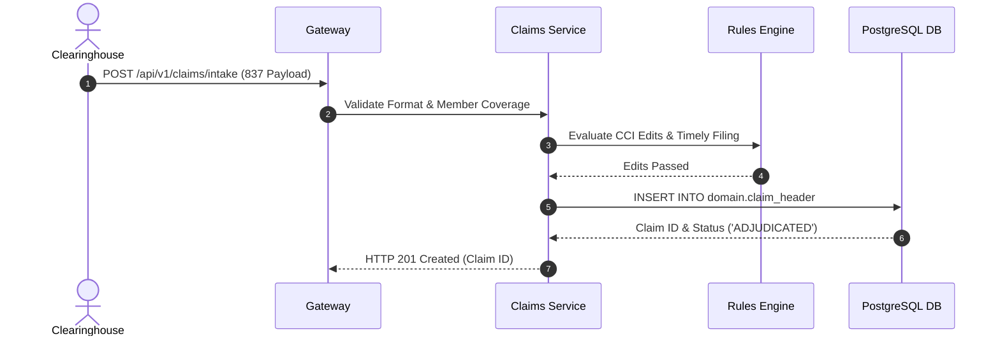

# Claims Intake, Pricing, & Adjudication — Implementation Specification

## Version 1.0.0

---

## 1. Purpose
The Claims Management module provides electronic 837 claim intake (Professional & Institutional), pre-adjudication edit validation, fee schedule pricing, automated adjudication rules processing, dispute resolution workflows, and 835 Electronic Remittance Advice (ERA) generation across HEMP.

---

## 2. Scope
Applies to HCFA-1500 (837P) professional claims, UB-04 (837I) institutional inpatient/outpatient claims, dental claims, and pharmacy encounter records.

---

## 3. Business Context
Claims adjudication is the core financial engine of healthcare administration. Clean claims must auto-adjudicate rapidly to reduce administrative overhead and meet prompt payment mandates.

---

## 4. Functional Requirements
- **FR-CLM-01**: Ingestion and validation of EDI 837P and 837I clearinghouse files.
- **FR-CLM-02**: Automated CCI (Correct Coding Initiative) and duplicate claim checks.
- **FR-CLM-03**: Fee schedule pricing calculation engine.
- **FR-CLM-04**: Adjudication decision engine (`RECEIVED -> ADJUDICATED -> PAID / DENIED`).
- **FR-CLM-05**: EDI 835 remittance advice file generation.

---

## 5. Non-Functional Requirements
- **NFR-CLM-01**: Batch auto-adjudication throughput > 1,000 claims per minute per service instance.
- **NFR-CLM-02**: Auto-adjudication rate target > 85% clean claims.

---

## 6. Actors & Personas
- **Claims Adjudicator**: Reviews suspended or flagged claim exceptions.
- **Claims Manager**: Approves high-dollar claim payouts over threshold ($50,000).
- **Billing Provider**: Submits claims and receives 835 payment remittances.

---

## 7. User Stories
- **US-CLM-01**: As a Claims Adjudicator, I want to review flagged duplicate claim warnings so that I can prevent improper duplicate payments.

---

## 8. UI Specifications & Wireframe Descriptions
- **Screen CLM-UI-01 (Claims Adjudication Workbench)**:
  - *Navigation*: Healthcare > Claims > Adjudication
  - *Breadcrumbs*: Home / Healthcare / Claims / Adjudication
  - *Wireframe*: Header action bar (`Submit Manual Claim`, `Reprocess Batch`). Master-detail split view: Left pane shows pending suspended claims. Right pane displays Claim Header, Diagnoses (ICD-10), Line Items (CPT/HCPCS), Adjudication Rules Triggered, and Payout Calculations.

---

## 9. Navigation & Breadcrumb Maps
```
Home
└── Healthcare
    ├── Claims Search (Home / Healthcare / Claims / Directory)
    └── Adjudication Workbench (Home / Healthcare / Claims / Adjudication)
```

---

## 10. Business Rules
- `CLM-BR-01`: A claim submitted past the timely filing deadline (365 days from service start date) MUST be denied (`TIMELY_FILING_EXCEEDED`).
- `CLM-BR-02`: Claims exceeding $50,000 require secondary manager approval before payment batch release.

---

## 11. Validation Rules & RegEx Contracts
- Diagnosis Code (ICD-10): `^[A-Z][0-9][0-9A-Z](\.[0-9A-Z]{1,4})?$`
- Procedure Code (CPT/HCPCS): `^[A-Z0-9]{5}$`

---

## 12. Workflow State Machine & Transitions
```
[RECEIVED] ──(PRICING)──► [PRICED] ──(ADJUDICATE)──► [ADJUDICATED]
                                                           │
                                   ┌───────────────────────┴───────────────────────┐
                                   ▼                                               ▼
                              (PAYMENT)                                         (DENY)
                                   │                                               │
                                   ▼                                               ▼
                                [PAID]                                          [DENIED]
```

---

## 13. Sequence Diagrams


---

## 14. Database Schema & DDL Links
Reference: [database/ddl/09_claims.sql](file:///c:/Users/affra/Documents/ETS/Enterprise%20Healthcare%20Management%20Platform/database/ddl/09_claims.sql)
Table: `domain.claim_header`.

---

## 15. Complete Data Dictionary
| Table | Column | Data Type | Nullable | Description |
|-------|--------|-----------|----------|-------------|
| `domain.claim_header` | `claim_id` | UUID | No | Primary Key |
| `domain.claim_header` | `claim_number` | VARCHAR(64) | No | Unique Claim Tracking Number |
| `domain.claim_header` | `total_billed_amount` | NUMERIC(12,2) | No | Billed Amount |
| `domain.claim_header` | `claim_status` | VARCHAR(32) | No | Status (`RECEIVED`, `PAID`, `DENIED`) |

---

## 16. API Specifications
- `POST /api/v1/claims/intake`: Submit 837 claim batch or single claim.
- `GET /api/v1/claims/{id}`: Fetch detailed claim adjudication breakdown.

---

## 17. Error Codes (RFC 7807 Compliant)
- `CLM-ERR-4001`: Duplicate Claim Detected (`409 Conflict`).
- `CLM-ERR-4002`: Timely Filing Deadline Exceeded (`422 Unprocessable`).

---

## 18. Security & RBAC Matrix
- `healthcare:claims:view`: View claims.
- `healthcare:claims:adjudicate`: Perform adjudication actions and manual overrides.

---

## 19. Immutable Audit Logging Specs
- Logs `CLAIM_RECEIVED`, `CLAIM_ADJUDICATED`, `CLAIM_PAID`, `CLAIM_DENIED`.

---

## 20. Reporting & Dashboard Metrics
- First-Pass Auto-Adjudication Rate (Target > 85%).
- Total Paid Claims Volume & Financial Liability.

---

## 21. AI Metadata & Tool Registry
- `search_claims(status?: string, providerId?: string, memberId?: string)`

---

## 22. Semantic Mapping & Text-to-SQL Catalog
- Business Definition: "Healthcare claims, bills, encounters, adjudication status, and payout amounts."
- Synonyms: "Bills", "Encounters", "Invoices", "Claims".
- Example Query: `"Show total paid claims billed by General Hospital last month"`.

---

## 23. Performance & Latency Targets
- Adjudication Processing: < 200ms per claim.

---

## 24. Test Cases & Acceptance Criteria
- `TC-CLM-001`: Valid 837P submission for active member returns HTTP 201 with status `ADJUDICATED`.

---

## 25. Acceptance Criteria Matrix
- Claims submitted past 365 days auto-deny with `CLM-ERR-4002`.

---

## 26. Future Enhancements
- Predictive ML models for fraud, waste, and abuse (FWA) detection prior to payment batch release.

---

## 27. Cross References
- [01_Architecture.md](file:///c:/Users/affra/Documents/ETS/Enterprise%20Healthcare%20Management%20Platform/specifications/01_Architecture.md)

---

## 28. Revision History
- **v1.0.0** (2026-08-05): Production-Ready Implementation Specification release.
