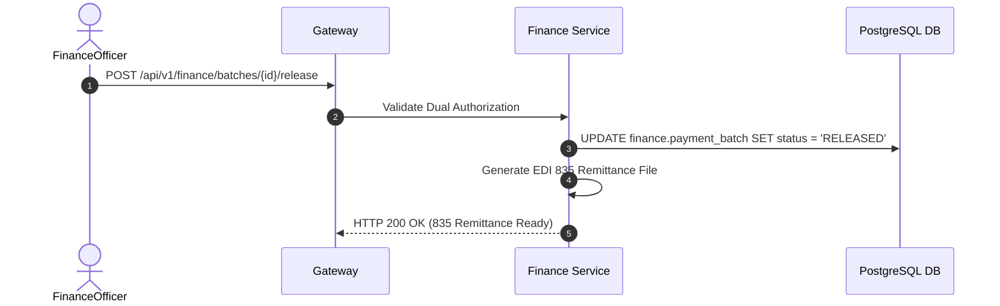

# Financial Management — Implementation Specification

## Version 1.0.0

---

## 1. Purpose
The Financial Management module provides claim payment processing, check/EFT 835 remittance generation, provider financial ledgers, 1099 tax reporting, and accounts payable reconciliation across HEMP.

---

## 2. Scope
Applies to provider claim payments, member premium billing, 835 ERA generation, and financial ledger posting.

---

## 3. Business Context
Accurate financial processing ensures healthcare providers are paid promptly while accounting for copays, deductibles, third-party liability offsets, and tax withholdings.

---

## 4. Functional Requirements
- **FR-FIN-01**: Claim Payment Batch Processing (Weekly / Daily cycle).
- **FR-FIN-02**: EDI 835 Remittance Advice File Generation.
- **FR-FIN-03**: Provider 1099 Tax Reporting & Year-End Accumulators.

---

## 5. Non-Functional Requirements
- **NFR-FIN-01**: Batch payment generation throughput > 5,000 paid claims per minute.

---

## 6. Actors & Personas
- **Finance Officer**: Approves payment batch releases and issues checks/EFTs.
- **Billing Provider**: Receives 835 payment remittances.

---

## 7. User Stories
- **US-FIN-01**: As a Finance Officer, I want to review payment batch summary totals before approving EFT distribution so that I can ensure financial accuracy.

---

## 8. UI Specifications & Wireframe Descriptions
- **Screen FIN-UI-01 (Payment Batch Release Workbench)**:
  - *Navigation*: Healthcare > Finance > Payment Batches
  - *Wireframe*: Summary header (Total Payment Amount, Claim Count, Batch Date). Grid of claims included in batch with Approve Payment Release button.

---

## 9. Navigation & Breadcrumb Maps
```
Home
└── Healthcare
    ├── Financial Ledgers (Home / Healthcare / Finance / Ledgers)
    └── Payment Batches (Home / Healthcare / Finance / Batches)
```

---

## 10. Business Rules
- `FIN-BR-01`: Payment batches exceeding $250,000 require dual authorization by CFO or Finance Director.

---

## 11. Validation Rules & RegEx Contracts
- EFT Routing Number: 9 numeric digits (`^\d{9}$`).

---

## 12. Workflow State Machine & Transitions
```
[BATCH_CREATED] ──(APPROVE)──► [PAYMENT_RELEASED] ──(DISPATCH_835)──► [REMITTED]
```

---

## 13. Sequence Diagrams


---

## 14. Database Schema & DDL Links
Reference: [database/ddl/19_finance.sql](file:///c:/Users/affra/Documents/ETS/Enterprise%20Healthcare%20Management%20Platform/database/ddl/19_finance.sql)
Table: `finance.payment_batch`.

---

## 15. Complete Data Dictionary
| Table | Column | Data Type | Nullable | Description |
|-------|--------|-----------|----------|-------------|
| `finance.payment_batch` | `batch_id` | UUID | No | Primary Key |
| `finance.payment_batch` | `total_amount` | NUMERIC(14,2) | No | Batch Total Amount |

---

## 16. API Specifications
- `GET /api/v1/finance/batches`: List payment batches.
- `POST /api/v1/finance/batches/{id}/release`: Approve payment batch.

---

## 17. Error Codes (RFC 7807 Compliant)
- `FIN-ERR-5001`: Dual Authorization Required (`403 Forbidden`).

---

## 18. Security & RBAC Matrix
- `healthcare:finance:view`: View ledgers.
- `healthcare:finance:release`: Approve payment batches.

---

## 19. Immutable Audit Logging Specs
- Logs `PAYMENT_BATCH_RELEASED`, `835_REMITTANCE_GENERATED`.

---

## 20. Reporting & Dashboard Metrics
- Monthly Claims Payout Summary & 1099 Tax Totals.

---

## 21. AI Metadata & Tool Registry
- `get_payment_status(claimId: string)`

---

## 22. Semantic Mapping & Text-to-SQL Catalog
- Business Definition: "Financial payments, remittances, EFT transfers, 835 EDI files, and ledgers."

---

## 23. Performance & Latency Targets
- Batch Release Processing: < 500ms.

---

## 24. Test Cases & Acceptance Criteria
- `TC-FIN-001`: Releasing approved payment batch generates 835 remittance file and updates ledger status.

---

## 25. Acceptance Criteria Matrix
- Single-user approval on > $250k batches returns `FIN-ERR-5001`.

---

## 26. Future Enhancements
- Real-time ACH payments API integration.

---

## 27. Cross References
- [01_Architecture.md](file:///c:/Users/affra/Documents/ETS/Enterprise%20Healthcare%20Management%20Platform/specifications/01_Architecture.md)

---

## 28. Revision History
- **v1.0.0** (2026-08-05): Production-Ready Implementation Specification release.
