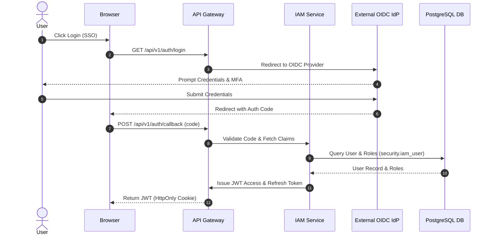

# Identity & Access Management (IAM) — Implementation Specification

## Version 1.0.0

---

## 1. Purpose
The Identity & Access Management (IAM) module provides enterprise authentication, authorization, user lifecycle management, multi-tier organization hierarchy, session monitoring, API key security, and AI service account controls for the HEMP platform. It is the foundational security layer upon which all healthcare modules depend.

---

## 2. Scope
Applies to all platform users (administrators, clinical providers, beneficiaries, claims adjudicators, finance officers, auditors), machine-to-machine API clients, microservices, and AI assistant service accounts across web, mobile, and batch interfaces.

---

## 3. Business Context
Enterprise healthcare administration requires strict HIPAA security compliance, multi-tenant organization isolation, granular role-based and attribute-based access control, and complete auditability of all privilege changes and data access events.

---

## 4. Functional Requirements
- **FR-IAM-01**: Multi-protocol enterprise authentication (OIDC, OAuth2, LDAP, SAML 2.0, Local Fallback).
- **FR-IAM-02**: User lifecycle management (Self-registration, Admin provisioning, Identity sync, Account locking, Disabling).
- **FR-IAM-03**: Granular Role-Based Access Control (RBAC) and Attribute-Based Access Control (ABAC).
- **FR-IAM-04**: Machine-to-machine API client credential management and scope enforcement.
- **FR-IAM-05**: Session management with automatic inactivity timeouts, IP binding, and remote session revocation.

---

## 5. Non-Functional Requirements
- **NFR-IAM-01**: Authentication response latency < 100ms at 99th percentile.
- **NFR-IAM-02**: High availability target 99.99% uptime with Redis session clustering.
- **NFR-IAM-03**: Support 100,000 concurrent active sessions.

---

## 6. Actors & Personas
- **System Administrator**: Manages global system roles, security parameters, and API clients.
- **Security Administrator**: Oversees user permissions, MFA enforcement, and security audit logs.
- **Organization Administrator**: Provision users within their specific organization hierarchy node.
- **Clinical Provider**: Accesses provider portals and patient charts.
- **Member Beneficiary**: Accesses personal coverage, claims status, and ID cards.
- **AI Service Account**: Authenticated background service executing authorized tools.

---

## 7. User Stories
- **US-IAM-01**: As a Security Admin, I want to assign pre-configured roles to new users so that they receive appropriate least-privilege access immediately.
- **US-IAM-02**: As an Auditor, I want to view a real-time list of active user sessions so that I can revoke suspicious logins.

---

## 8. UI Specifications & Wireframe Descriptions
- **Screen IAM-UI-01 (User Management Grid)**:
  - *Navigation*: System Admin > Security > Users
  - *Breadcrumbs*: Home / Security / User Management
  - *Wireframe Layout*: Header action bar (`+ Add User`, `Export CSV`). Search filter drawer by role/status. Enterprise grid displaying Username, Email, Auth Source, Status, Last Login, Actions (`Edit`, `Disable`, `Reset MFA`).
- **Screen IAM-UI-02 (Role & Permission Matrix)**:
  - *Navigation*: System Admin > Security > Roles
  - *Wireframe Layout*: Split pane. Left pane lists system roles (`SYSTEM_ADMIN`, `CLAIMS_PROCESSOR`). Right pane displays checkbox grid of domain permissions categorized by module.

---

## 9. Navigation & Breadcrumb Maps
```
Home
└── Security
    ├── User Management (Home / Security / Users)
    ├── Role Management (Home / Security / Roles)
    ├── Active Sessions (Home / Security / Sessions)
    └── API Clients (Home / Security / API Clients)
```

---

## 10. Business Rules
- `IAM-BR-01`: A user account is automatically locked after 5 consecutive failed login attempts within 15 minutes.
- `IAM-BR-02`: System administrative roles (`SYSTEM_ADMIN`) cannot be deleted or unassigned from the root user.

---

## 11. Validation Rules & RegEx Contracts
- Username: `^[a-zA-Z0-9_.]{3,32}$`
- Email: `^[a-zA-Z0-9._%+-]+@[a-zA-Z0-9.-]+\.[a-zA-Z]{2,}$`
- Password Policy: Minimum 12 characters, at least 1 uppercase letter, 1 lowercase letter, 1 digit, and 1 special character (`!@#$%^&*`).

---

## 12. Workflow State Machine & Transitions

```
[INACTIVE] ──(PROVISION)──► [ACTIVE] ──(LOCKOUT)──► [LOCKED]
                               │                      │
                           (DISABLE)               (UNLOCK)
                               ▼                      │
                          [DISABLED] ◄────────────────┘
```

---

## 13. Sequence Diagrams



---

## 14. Database Schema & DDL Links
Reference: [database/ddl/02_security.sql](file:///c:/Users/affra/Documents/ETS/Enterprise%20Healthcare%20Management%20Platform/database/ddl/02_security.sql)
Tables: `security.iam_user`, `security.iam_role`, `security.iam_permission`, `security.iam_role_permission`, `security.iam_user_role`, `security.iam_group`, `security.iam_session`, `security.iam_api_client`.

---

## 15. Complete Data Dictionary

| Table | Column | Data Type | Nullable | Primary/Foreign Key | Description |
|-------|--------|-----------|----------|---------------------|-------------|
| `security.iam_user` | `user_id` | UUID | No | Primary Key | Unique user identifier (`gen_random_uuid()`) |
| `security.iam_user` | `username` | VARCHAR(128) | No | Unique Index | Unique login name |
| `security.iam_user` | `email` | VARCHAR(255) | No | Unique Index | Unique user email address |
| `security.iam_user` | `account_status` | VARCHAR(32) | No | None | Account state (`ACTIVE`, `LOCKED`, `DISABLED`) |

---

## 16. API Specifications

### REST Endpoints
- `POST /api/v1/auth/login`: Authenticate user and issue JWT.
- `POST /api/v1/auth/logout`: Revoke active session token.
- `GET /api/v1/users`: Search and filter application users.
- `POST /api/v1/users`: Provision a new user account.
- `GET /api/v1/roles`: Retrieve system role definitions.

---

## 17. Error Codes (RFC 7807 Compliant)
- `IAM-ERR-4001`: Invalid Credentials (`401 Unauthorized`).
- `IAM-ERR-4002`: Account Locked Due to Excessive Failed Logins (`403 Forbidden`).
- `IAM-ERR-4003`: JWT Token Expired (`401 Unauthorized`).
- `IAM-ERR-4004`: Insufficient Permission (`403 Forbidden`).

---

## 18. Security & RBAC Matrix

| Role | User View | User Create | Role Edit | Session Revoke |
|------|-----------|-------------|-----------|----------------|
| `SYSTEM_ADMIN` | ✅ | ✅ | ✅ | ✅ |
| `SECURITY_ADMIN` | ✅ | ✅ | ✅ | ✅ |
| `ORG_ADMIN` | ✅ | ✅ | ❌ | ❌ |
| `MEMBER_USER` | ❌ | ❌ | ❌ | ❌ |

---

## 19. Immutable Audit Logging Specs
Every security action writes an entry to `audit.audit_log`:
- `action_type`: `LOGIN_SUCCESS`, `LOGIN_FAILURE`, `PASSWORD_CHANGE`, `ROLE_ASSIGNED`, `SESSION_REVOKED`.

---

## 20. Reporting & Dashboard Metrics
- Active User Count (by Org & Role).
- Failed Login Trend (24-hour graph).
- Active Sessions Monitor.

---

## 21. AI Metadata & Tool Registry
Tools declared in `metadata/ai_tools/system_tools.json`:
- `search_users(query: string)`
- `check_user_permission(userId: string, permissionCode: string)`

---

## 22. Semantic Mapping & Text-to-SQL Catalog
Entry in `ai.semantic_catalog`:
- Business Definition: "Users, roles, permissions, and security sessions."
- Synonyms: "Accounts", "Logins", "Users", "Roles".
- Example Query: `"Show all locked accounts with failed logins in the last 24 hours"`.

---

## 23. Performance & Latency Targets
- JWT Validation: < 5ms (In-memory verification).
- User Provisioning: < 150ms.

---

## 24. Test Cases & Acceptance Criteria
- `TC-IAM-001`: Verify login with valid credentials returns HTTP 200 and valid JWT.
- `TC-IAM-002`: Verify 5 invalid login attempts locks account (`account_status = 'LOCKED'`).
- `TC-IAM-003`: Verify user without `security:user:create` permission receives HTTP 403 on user creation POST.

---

## 25. Acceptance Criteria Matrix
- All API endpoints return RFC 7807 compliant error payloads.
- Password hashes use Argon2id / bcrypt with work factor >= 12.

---

## 26. Future Enhancements
- Passkey / WebAuthn FIDO2 passwordless login.
- Dynamic Risk-Based Adaptive Authentication.

---

## 27. Cross References
- [03_Security_Architecture.md](file:///c:/Users/affra/Documents/ETS/Enterprise%20Healthcare%20Management%20Platform/specifications/03_Security_Architecture.md)
- [02_Database_Architecture.md](file:///c:/Users/affra/Documents/ETS/Enterprise%20Healthcare%20Management%20Platform/specifications/02_Database_Architecture.md)

---

## 28. Revision History
- **v1.0.0** (2026-08-05): Production-Ready Implementation Specification release.
