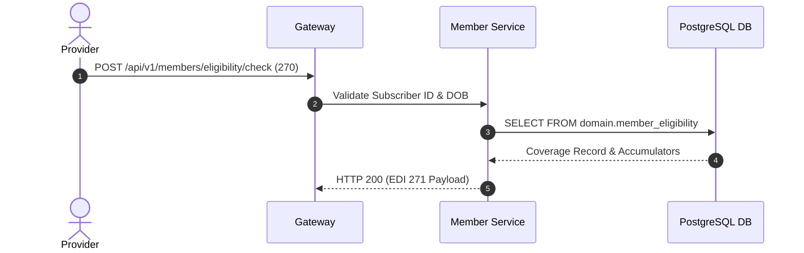

# Member & Beneficiary Management — Implementation Specification

## Version 1.0.0

---

## 1. Purpose
The Member Management module provides beneficiary demographic tracking, eligibility determination, benefit plan coverage management, dependent relationship links, EDI 834 enrollment processing, and real-time EDI 270/271 eligibility inquiry handling across HEMP.

---

## 2. Scope
Applies to Medicaid enrollees, Medicare beneficiaries, commercial health plan subscribers, and covered dependents.

---

## 3. Business Context
Payer organizations must verify member eligibility in real-time before claims adjudication or prior authorization reviews can proceed.

---

## 4. Functional Requirements
- **FR-MBR-01**: Member enrollment intake via EDI 834 batch files and online portal forms.
- **FR-MBR-02**: Real-time EDI 270/271 eligibility inquiry verification.
- **FR-MBR-03**: Benefit plan accumulator tracking (Deductible, Out-of-Pocket Maximum).

---

## 5. Non-Functional Requirements
- **NFR-MBR-01**: Real-time 270/271 eligibility verification response time < 150ms.
- **NFR-MBR-02**: Support 834 batch processing of 500,000 member records within 2 hours.

---

## 6. Actors & Personas
- **Member Beneficiary**: Views active coverage, copays, and digital ID card.
- **Eligibility Specialist**: Resolves enrollment discrepancy cases.
- **Provider Billing Staff**: Queries member eligibility via EDI 270.

---

## 7. User Stories
- **US-MBR-01**: As a Provider Billing Specialist, I want to query a patient's eligibility via EDI 270 so that I can confirm copay amounts before rendering services.

---

## 8. UI Specifications & Wireframe Descriptions
- **Screen MBR-UI-01 (Member Eligibility Search)**:
  - *Navigation*: Healthcare > Members > Eligibility
  - *Breadcrumbs*: Home / Healthcare / Members / Eligibility
  - *Wireframe*: Search panel (Subscriber ID, DOB, First Name, Last Name). Result card displaying Active Plan Name, Effective Dates, Copay Summary, and Deductible Accumulators.

---

## 9. Navigation & Breadcrumb Maps
```
Home
└── Healthcare
    ├── Member Search (Home / Healthcare / Members / Directory)
    └── Eligibility Verification (Home / Healthcare / Members / Eligibility)
```

---

## 10. Business Rules
- `MBR-BR-01`: A member MUST have an active benefit plan coverage record for claims to be approved.

---

## 11. Validation Rules & RegEx Contracts
- Subscriber ID: Alphanumeric 9-12 characters (`^[a-zA-Z0-9]{9,12}$`).
- DOB: Must be a past calendar date.

---

## 12. Workflow State Machine & Transitions
```
[PENDING_ENROLLMENT] ──(ELIGIBLE)──► [ACTIVE] ──(TERMINATE)──► [TERMINATED]
```

---

## 13. Sequence Diagrams


---

## 14. Database Schema & DDL Links
Reference: [database/ddl/08_member.sql](file:///c:/Users/affra/Documents/ETS/Enterprise%20Healthcare%20Management%20Platform/database/ddl/08_member.sql)
Table: `domain.member_eligibility`.

---

## 15. Complete Data Dictionary
| Table | Column | Data Type | Nullable | Description |
|-------|--------|-----------|----------|-------------|
| `domain.member_eligibility` | `member_id` | UUID | No | Primary Key |
| `domain.member_eligibility` | `subscriber_number` | VARCHAR(64) | No | Member Subscriber ID |
| `domain.member_eligibility` | `coverage_status` | VARCHAR(32) | No | State (`ACTIVE`, `TERMINATED`) |

---

## 16. API Specifications
- `POST /api/v1/members/eligibility/check`: Real-time 270/271 eligibility query.
- `GET /api/v1/members/{id}`: Fetch member demographic details.

---

## 17. Error Codes (RFC 7807 Compliant)
- `MBR-ERR-3001`: Member Not Found (`404 Not Found`).
- `MBR-ERR-3002`: Member Coverage Inactive on Service Date (`422 Unprocessable`).

---

## 18. Security & RBAC Matrix
- `healthcare:member:view`: View member coverage.
- `healthcare:member:edit`: Modify member demographics.

---

## 19. Immutable Audit Logging Specs
- Logs `MEMBER_ELIGIBILITY_CHECKED`, `MEMBER_COVERAGE_TERMINATED`.

---

## 20. Reporting & Dashboard Metrics
- Total Active Enrollees by Plan Type.

---

## 21. AI Metadata & Tool Registry
- `check_member_eligibility(memberId: string, serviceDate: string)`

---

## 22. Semantic Mapping & Text-to-SQL Catalog
- Business Definition: "Health plan members, beneficiaries, eligibility, and deductibles."
- Synonyms: "Patients", "Beneficiaries", "Enrollees", "Members".

---

## 23. Performance & Latency Targets
- 270/271 Response Latency: < 150ms.

---

## 24. Test Cases & Acceptance Criteria
- `TC-MBR-001`: Valid active subscriber ID returns HTTP 200 with `ACTIVE` coverage status.

---

## 25. Acceptance Criteria Matrix
- Inactive members return `MBR-ERR-3002`.

---

## 26. Future Enhancements
- Real-time digital ID card Wallet integration (Apple Wallet / Google Pay).

---

## 27. Cross References
- [01_Architecture.md](file:///c:/Users/affra/Documents/ETS/Enterprise%20Healthcare%20Management%20Platform/specifications/01_Architecture.md)

---

## 28. Revision History
- **v1.0.0** (2026-08-05): Production-Ready Implementation Specification release.
