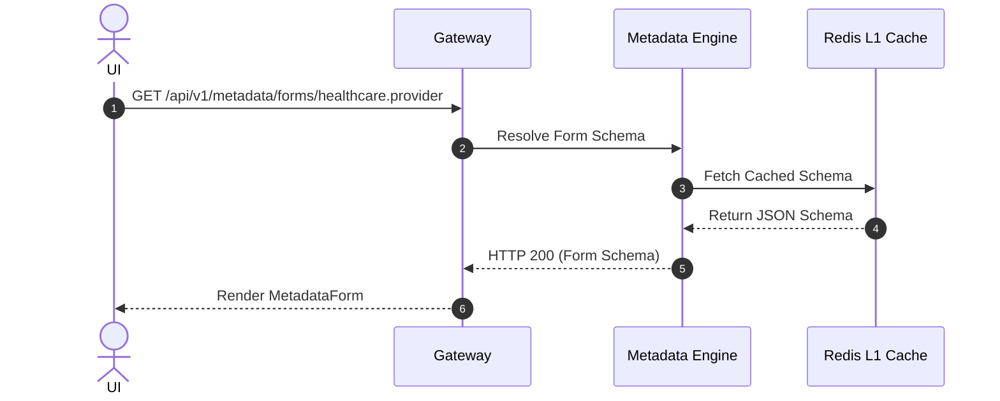

# Metadata Engine — Implementation Specification

## Version 1.0.0

---

## 1. Purpose
The Metadata Engine is the platform runtime core of EHP-OS that registers entity models, attribute definitions, relationships, form layouts, dynamic grid views, and AI semantic maps.

---

## 2. Scope
Governs all dynamic schema hydration, dynamic form rendering, grid column resolution, and AI RAG schema mapping across HEMP.

---

## 3. Business Context
Dynamic metadata-driven execution decouples business domain configurations from raw application source code, allowing changes without code recompilation.

---

## 4. Functional Requirements
- **FR-MDE-01**: Entity Metadata Registration & Cache Hydration.
- **FR-MDE-02**: Dynamic Form & UI Grid Schema Generation.
- **FR-MDE-03**: Relationship Resolution (`ONE_TO_MANY`, `MANY_TO_ONE`, `MANY_TO_MANY`).

---

## 5. Non-Functional Requirements
- **NFR-MDE-01**: In-memory metadata schema hydration time < 5ms.

---

## 6. Actors & Personas
- **Platform Architect**: Registers core entity JSON definitions.
- **Form Engine**: Reads metadata schemas to render UI inputs dynamically.

---

## 7. User Stories
- **US-MDE-01**: As a Developer, I want to add a field to `metadata/entities/provider.json` so that the UI form updates automatically without backend code changes.

---

## 8. UI Specifications & Wireframe Descriptions
- **Screen MDE-UI-01 (Metadata Registry Viewer)**:
  - *Navigation*: Administration > System > Metadata Engine
  - *Wireframe Layout*: Left pane displays list of registered entity schemas. Right pane displays JSON schema editor with validation checks.

---

## 9. Navigation & Breadcrumb Maps
```
Home
└── Administration
    └── Metadata Engine (Home / Administration / Metadata)
```

---

## 10. Business Rules
- `MDE-BR-01`: Entity metadata changes MUST preserve backward compatibility with active database table columns.

---

## 11. Validation Rules & RegEx Contracts
- `entityId`: Lowercase domain-qualified string (`^[a-z0-9_]+\.[a-z0-9_]+$`).

---

## 12. Workflow State Machine & Transitions
```
[DRAFT_SCHEMA] ──(REGISTER)──► [ACTIVE_SCHEMA] ──(DEPRECATE)──► [DEPRECATED]
```

---

## 13. Sequence Diagrams


---

## 14. Database Schema & DDL Links
Reference: [database/ddl/03_metadata.sql](file:///c:/Users/affra/Documents/ETS/Enterprise%20Healthcare%20Management%20Platform/database/ddl/03_metadata.sql)
Table: `metadata.entity_definition`.

---

## 15. Complete Data Dictionary
| Table | Column | Data Type | Nullable | Description |
|-------|--------|-----------|----------|-------------|
| `metadata.entity_definition` | `entity_id` | VARCHAR(64) | No | Primary Key |
| `metadata.entity_definition` | `table_name` | VARCHAR(128) | No | Database Table Name |

---

## 16. API Specifications
- `GET /api/v1/metadata/entities`: List registered entity definitions.
- `GET /api/v1/metadata/forms/{entityId}`: Fetch UI form schema.

---

## 17. Error Codes (RFC 7807 Compliant)
- `MDE-ERR-1001`: Entity Definition Not Found (`404 Not Found`).

---

## 18. Security & RBAC Matrix
- `system:metadata:view`: View metadata schemas.
- `system:metadata:edit`: Modify entity definitions.

---

## 19. Immutable Audit Logging Specs
- Logs `METADATA_REGISTERED`, `METADATA_UPDATED`.

---

## 20. Reporting & Dashboard Metrics
- Registered Entity Count by Domain.

---

## 21. AI Metadata & Tool Registry
- `get_entity_schema(entityId: string)`

---

## 22. Semantic Mapping & Text-to-SQL Catalog
- Business Definition: "Metadata platform registry for entity definitions and forms."

---

## 23. Performance & Latency Targets
- Schema Resolution: < 5ms.

---

## 24. Test Cases & Acceptance Criteria
- `TC-MDE-001`: Valid entity ID returns HTTP 200 with complete JSON schema payload.

---

## 25. Acceptance Criteria Matrix
- Unregistered entity IDs return `MDE-ERR-1001`.

---

## 26. Future Enhancements
- Visual drag-and-drop Schema Builder Studio.

---

## 27. Cross References
- [07_Metadata_Model.md](file:///c:/Users/affra/Documents/ETS/Enterprise%20Healthcare%20Management%20Platform/specifications/07_Metadata_Model.md)

---

## 28. Revision History
- **v1.0.0** (2026-08-05): Production-Ready Implementation Specification release.
