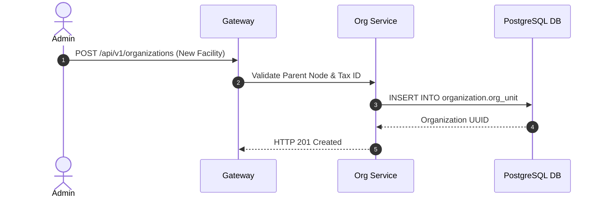

# Organization Management — Implementation Specification

## Version 1.0.0

---

## 1. Purpose
The Organization Management module provides multi-tier organization hierarchy, regional division boundaries, facility networks, payer organization profiles, and corporate entity tracking across HEMP.

---

## 2. Scope
Applies to health plan payers, provider hospital networks, group practices, billing agencies, and internal enterprise administrative units.

---

## 3. Business Context
Healthcare systems require multi-level organization structures to manage parent-child relationships between health systems, clinics, departments, and regional networks.

---

## 4. Functional Requirements
- **FR-ORG-01**: Unlimited parent-child organization hierarchy modeling (`Enterprise -> Region -> Division -> Facility -> Department -> Team`).
- **FR-ORG-02**: Organization profile management (Legal Name, DBA Name, Tax ID, NPI, Address).
- **FR-ORG-03**: Effective dating and history tracking for organizational restructuring.

---

## 5. Non-Functional Requirements
- **NFR-ORG-01**: Hierarchy traversal query response latency < 50ms.
- **NFR-ORG-02**: Support up to 10,000 organization units per enterprise deployment.

---

## 6. Actors & Personas
- **System Administrator**: Creates top-level enterprise nodes and regional units.
- **Organization Admin**: Manages department facilities and child teams.

---

## 7. User Stories
- **US-ORG-01**: As an Administrator, I want to create child clinic locations under a primary hospital group so that billing and provider assignments inherit parent network contracts.

---

## 8. UI Specifications & Wireframe Descriptions
- **Screen ORG-UI-01 (Organization Hierarchy Tree)**:
  - *Navigation*: Administration > Organization > Hierarchy
  - *Wireframe Layout*: Tree view on left pane. Detail view on right pane displaying Legal Name, Tax ID, Active Facilities, and Child Units.

---

## 9. Navigation & Breadcrumb Maps
```
Home
└── Administration
    └── Organization Hierarchy (Home / Administration / Organization)
```

---

## 10. Business Rules
- `ORG-BR-01`: An organization node cannot be set as its own parent or ancestor (cycles prohibited).

---

## 11. Validation Rules & RegEx Contracts
- NPI (Facility): 10 numeric digits (`^\d{10}$`).
- Tax ID (EIN): 9 numeric digits (`^\d{9}$`).

---

## 12. Workflow State Machine & Transitions
```
[DRAFT] ──(ACTIVATE)──► [ACTIVE] ──(INACTIVATE)──► [INACTIVE]
```

---

## 13. Sequence Diagrams


---

## 14. Database Schema & DDL Links
Reference: [database/ddl/03_organization.sql](file:///c:/Users/affra/Documents/ETS/Enterprise%20Healthcare%20Management%20Platform/database/ddl/03_organization.sql)
Table: `organization.org_unit`.

---

## 15. Complete Data Dictionary
| Table | Column | Data Type | Nullable | Description |
|-------|--------|-----------|----------|-------------|
| `organization.org_unit` | `org_id` | UUID | No | Primary Key |
| `organization.org_unit` | `parent_org_id` | UUID | Yes | Foreign Key to parent org node |
| `organization.org_unit` | `org_name` | VARCHAR(255) | No | Legal or operational unit name |

---

## 16. API Specifications
- `GET /api/v1/organizations`: Fetch organization tree.
- `POST /api/v1/organizations`: Create new org unit.

---

## 17. Error Codes (RFC 7807 Compliant)
- `ORG-ERR-1001`: Circular Organization Parent Loop Detected (`400 Bad Request`).

---

## 18. Security & RBAC Matrix
- `organization:org:view`: Required to view org tree.
- `organization:org:edit`: Required to modify org nodes.

---

## 19. Immutable Audit Logging Specs
- Logs `ORG_UNIT_CREATED`, `ORG_UNIT_UPDATED`, `PARENT_NODE_CHANGED`.

---

## 20. Reporting & Dashboard Metrics
- Active Facility Count by Region.

---

## 21. AI Metadata & Tool Registry
- `get_organization_hierarchy(orgId: string)`

---

## 22. Semantic Mapping & Text-to-SQL Catalog
- Business Definition: "Organizational hierarchy, facility units, and clinics."

---

## 23. Performance & Latency Targets
- Hierarchy Tree Query: < 40ms.

---

## 24. Test Cases & Acceptance Criteria
- `TC-ORG-001`: Verify creating child facility attaches correctly under valid parent org node.

---

## 25. Acceptance Criteria Matrix
- Hierarchy cycles return `ORG-ERR-1001`.

---

## 26. Future Enhancements
- Visual organization chart drag-and-drop node mover.

---

## 27. Cross References
- [01_Architecture.md](file:///c:/Users/affra/Documents/ETS/Enterprise%20Healthcare%20Management%20Platform/specifications/01_Architecture.md)

---

## 28. Revision History
- **v1.0.0** (2026-08-05): Production-Ready Implementation Specification release.
