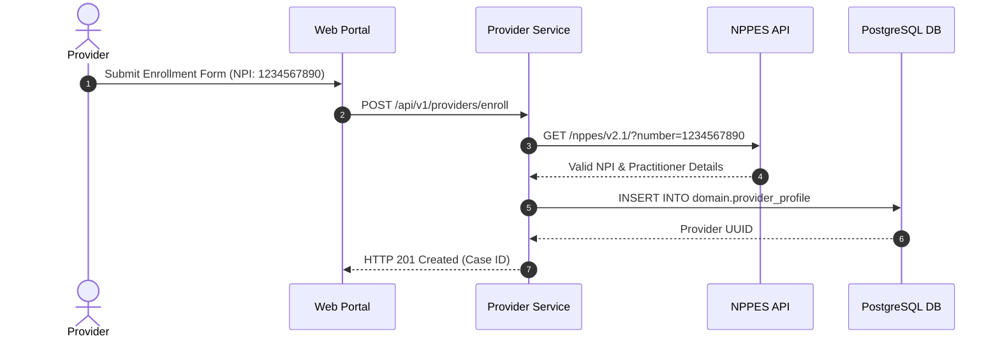

# Healthcare Provider Management — Implementation Specification

## Version 1.0.0

---

## 1. Purpose
The Provider Management module provides end-to-end credentialing, network enrollment, medical taxonomy classification, DEA/license verification, practice location mapping, and periodic 36-month revalidation workflows for individual practitioners and healthcare facility networks.

---

## 2. Scope
Applies to individual physicians, nurse practitioners, physician assistants, hospitals, ambulatory surgical centers, laboratories, and allied health vendor groups.

---

## 3. Business Context
Payer organizations must maintain an accurate, verified provider directory to ensure network adequacy, comply with Medicaid/Medicare CMS regulations, and prevent fraudulent billing.

---

## 4. Functional Requirements
- **FR-PRV-01**: Provider enrollment application intake (Direct Portal & 837 / CAQH data ingestion).
- **FR-PRV-02**: Real-time 10-digit NPI registry validation via NPPES API.
- **FR-PRV-03**: State medical license, DEA, and board certification verification.
- **FR-PRV-04**: Credentialing Committee review case workflow (`SUBMITTED -> IN_CREDENTIALING -> APPROVED / REJECTED`).
- **FR-PRV-05**: Automated 36-month revalidation tracking and reminder notifications.

---

## 5. Non-Functional Requirements
- **NFR-PRV-01**: Provider directory search response time < 100ms.
- **NFR-PRV-02**: NPPES external API verification timeout < 3 seconds with fallback circuit breaker.

---

## 6. Actors & Personas
- **Provider Applicant**: Individual practitioner submitting enrollment details.
- **Credentialing Specialist**: Reviews license documents and primary source verifications.
- **Medical Director / Committee Chair**: Approves or denies credentialing applications.
- **Network Manager**: Manages fee schedules and contract attachments.

---

## 7. User Stories
- **US-PRV-01**: As a Credentialing Specialist, I want to view verified primary source license documents alongside the provider application so that I can make an informed approval decision.

---

## 8. UI Specifications & Wireframe Descriptions
- **Screen PRV-UI-01 (Provider Directory Grid)**:
  - *Navigation*: Healthcare > Providers > Directory
  - *Breadcrumbs*: Home / Healthcare / Providers / Directory
  - *Wireframe*: Header action bar (`+ Enroll Provider`, `Export Network Roster`). Filter drawer by NPI, Specialty, County, Network Status. Data grid displaying NPI, Full Name, Taxonomy, License, Status (`ACTIVE`, `PENDING`), Actions (`View Profile`, `Trigger Revalidation`).

---

## 9. Navigation & Breadcrumb Maps
```
Home
└── Healthcare
    ├── Provider Directory (Home / Healthcare / Providers / Directory)
    ├── Enrollment Applications (Home / Healthcare / Providers / Enrollment)
    └── Revalidation Tracker (Home / Healthcare / Providers / Revalidation)
```

---

## 10. Business Rules
- `PRV-BR-01`: An individual provider MUST possess an active, unencumbered state medical license in the state where services are rendered.
- `PRV-BR-02`: Revalidation MUST occur every 36 months from initial approval date.

---

## 11. Validation Rules & RegEx Contracts
- NPI: 10 numeric digits (`^\d{10}$`) passing Luhn algorithm.
- Taxonomy Code: 10 alphanumeric characters matching NUCC Provider Taxonomy Code Set (`^[0-9A-Z]{10}$`).

---

## 12. Workflow State Machine & Transitions
```
[DRAFT] ──(SUBMIT)──► [SUBMITTED] ──(START_REVIEW)──► [IN_CREDENTIALING]
                                                              │
                                     ┌────────────────────────┴────────────────────────┐
                                     ▼                                                 ▼
                               (APPROVE)                                           (REJECT)
                                     │                                                 │
                                     ▼                                                 ▼
                                [APPROVED]                                         [REJECTED]
```

---

## 13. Sequence Diagrams


---

## 14. Database Schema & DDL Links
Reference: [database/ddl/07_provider.sql](file:///c:/Users/affra/Documents/ETS/Enterprise%20Healthcare%20Management%20Platform/database/ddl/07_provider.sql)
Tables: `domain.provider_profile`, `provider.credentialing_case`, `provider.network_contract`.

---

## 15. Complete Data Dictionary
| Table | Column | Data Type | Nullable | Primary/Foreign Key | Description |
|-------|--------|-----------|----------|---------------------|-------------|
| `domain.provider_profile` | `provider_id` | UUID | No | Primary Key | Provider UUID |
| `domain.provider_profile` | `npi` | VARCHAR(10) | No | Unique Index | 10-digit National Provider Identifier |
| `domain.provider_profile` | `taxonomy_code` | VARCHAR(32) | No | None | NUCC Specialty Taxonomy Code |

---

## 16. API Specifications
- `GET /api/v1/providers`: Query provider directory.
- `POST /api/v1/providers/enroll`: Submit enrollment application.
- `PATCH /api/v1/providers/{id}/credential`: Action credentialing status.

---

## 17. Error Codes (RFC 7807 Compliant)
- `PRV-ERR-2001`: Invalid NPI Checksum (`400 Bad Request`).
- `PRV-ERR-2002`: Expired State License (`422 Unprocessable Entity`).

---

## 18. Security & RBAC Matrix
- `healthcare:provider:view`: View provider profiles.
- `healthcare:provider:enroll`: Submit application.
- `healthcare:provider:credential`: Approve credentialing file.

---

## 19. Immutable Audit Logging Specs
- Logs `PROVIDER_ENROLLED`, `CREDENTIALING_APPROVED`, `REVALIDATION_COMPLETED`.

---

## 20. Reporting & Dashboard Metrics
- Credentialing Case SLA Aging.
- Provider Network Coverage by County.

---

## 21. AI Metadata & Tool Registry
- `search_providers(query: string, specialty?: string, state?: string)`

---

## 22. Semantic Mapping & Text-to-SQL Catalog
- Business Definition: "Healthcare practitioners, physicians, facilities, and credentialing state."
- Synonyms: "Doctors", "Physicians", "Clinicians", "Providers".
- Example Query: `"Show active cardiology providers in Miami awaiting revalidation"`.

---

## 23. Performance & Latency Targets
- Provider Directory Search: < 100ms.

---

## 24. Test Cases & Acceptance Criteria
- `TC-PRV-001`: Valid 10-digit NPI enrollment returns HTTP 201.
- `TC-PRV-002`: Invalid 9-digit NPI returns HTTP 400 with `PRV-ERR-2001`.

---

## 25. Acceptance Criteria Matrix
- All credentialing state changes generate immutable audit log entries.

---

## 26. Future Enhancements
- Automated CAQH ProView direct API synchronization.

---

## 27. Cross References
- [00_Project_Context.md](file:///c:/Users/affra/Documents/ETS/Enterprise%20Healthcare%20Management%20Platform/specifications/00_Project_Context.md)
- [01_Architecture.md](file:///c:/Users/affra/Documents/ETS/Enterprise%20Healthcare%20Management%20Platform/specifications/01_Architecture.md)

---

## 28. Revision History
- **v1.0.0** (2026-08-05): Production-Ready Implementation Specification release.
