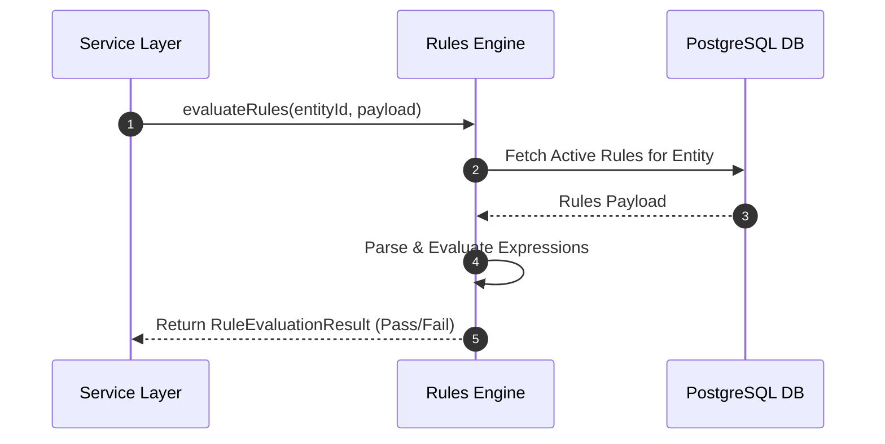

# Rules Engine — Implementation Specification

## Version 1.0.0

---

## 1. Purpose
The Rules Engine is the platform runtime service executing declarative validation rules, decision tables, pricing logic, and routing rules across HEMP.

---

## 2. Scope
Applies to provider NPI checksum validations, claims timely filing checks, CCI coding edits, and prior auth auto-approval scoring.

---

## 3. Business Context
Decoupling business validation rules into declarative metadata allows business analysts to modify rules without requiring application source code changes.

---

## 4. Functional Requirements
- **FR-RLE-01**: Declarative Rule Evaluation (`IF condition THEN action`).
- **FR-RLE-02**: Decision Table Matrix Evaluation.
- **FR-RLE-03**: Rule Priority & Early Termination Flags.

---

## 5. Non-Functional Requirements
- **NFR-RLE-01**: Single rule evaluation latency < 10ms.

---

## 6. Actors & Personas
- **Business Analyst**: Defines rules in JSON schemas (`rules.business_rule`).
- **Application Engine**: Triggers rule evaluation prior to database persistence.

---

## 7. User Stories
- **US-RLE-01**: As a Claims Specialist, I want timely filing rules to be evaluated automatically so that invalid claims reject immediately.

---

## 8. UI Specifications & Wireframe Descriptions
- **Screen RLE-UI-01 (Business Rule Matrix Viewer)**:
  - *Navigation*: Administration > System > Rules Engine
  - *Wireframe*: Grid listing Rule ID, Entity, Condition Expression, Action, Priority, Active Flag.

---

## 9. Navigation & Breadcrumb Maps
```
Home
└── Administration
    └── Rules Engine (Home / Administration / Rules)
```

---

## 10. Business Rules
- `RLE-BR-01`: Rules with higher priority numbers execute first.

---

## 11. Validation Rules & RegEx Contracts
- `ruleId`: `^[a-z0-9._]+$`

---

## 12. Workflow State Machine & Transitions
```
[DRAFT_RULE] ──(TEST)──► [ACTIVE_RULE] ──(DISABLE)──► [DISABLED]
```

---

## 13. Sequence Diagrams


---

## 14. Database Schema & DDL Links
Reference: [database/ddl/06_rules.sql](file:///c:/Users/affra/Documents/ETS/Enterprise%20Healthcare%20Management%20Platform/database/ddl/06_rules.sql)
Table: `rules.business_rule`.

---

## 15. Complete Data Dictionary
| Table | Column | Data Type | Nullable | Description |
|-------|--------|-----------|----------|-------------|
| `rules.business_rule` | `rule_id` | VARCHAR(64) | No | Primary Key |
| `rules.business_rule` | `condition_expression` | TEXT | No | Expression string |

---

## 16. API Specifications
- `POST /api/v1/rules/evaluate`: Evaluate rules against input payload.

---

## 17. Error Codes (RFC 7807 Compliant)
- `RLE-ERR-3001`: Expression Syntax Error (`400 Bad Request`).

---

## 18. Security & RBAC Matrix
- `system:rules:view`: View business rules.
- `system:rules:edit`: Modify rule expressions.

---

## 19. Immutable Audit Logging Specs
- Logs `RULE_EVALUATED_FAIL`, `RULE_UPDATED`.

---

## 20. Reporting & Dashboard Metrics
- Most Frequently Triggered Validation Errors.

---

## 21. AI Metadata & Tool Registry
- `evaluate_business_rule(ruleId: string, context: object)`

---

## 22. Semantic Mapping & Text-to-SQL Catalog
- Business Definition: "Business rules, validation expressions, and decision tables."

---

## 23. Performance & Latency Targets
- Rule Evaluation: < 10ms.

---

## 24. Test Cases & Acceptance Criteria
- `TC-RLE-001`: Valid payload satisfies rule condition and returns `passed = true`.

---

## 25. Acceptance Criteria Matrix
- Invalid expression syntax returns `RLE-ERR-3001`.

---

## 26. Future Enhancements
- Visual drag-and-drop Decision Table builder.

---

## 27. Cross References
- [09_Rules_Engine.md](file:///c:/Users/affra/Documents/ETS/Enterprise%20Healthcare%20Management%20Platform/specifications/09_Rules_Engine.md)

---

## 28. Revision History
- **v1.0.0** (2026-08-05): Production-Ready Implementation Specification release.
