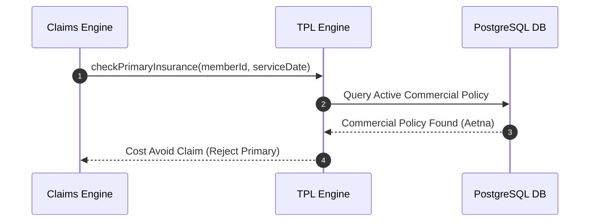

# Third Party Liability (TPL) — Implementation Specification

## Version 1.0.0

---

## 1. Purpose
The Third Party Liability (TPL) module manages Coordination of Benefits (COB), commercial primary insurance identification, casualty liability recovery, and Medicaid cost avoidance processing across HEMP.

---

## 2. Scope
Applies to Medicaid enrollees with commercial primary coverage, automobile accident casualty claims, and workers' compensation recovery cases.

---

## 3. Business Context
State Medicaid plans are payers of last resort. TPL processing ensures commercial insurance or liability carriers pay primary before Medicaid funds are disbursed.

---

## 4. Functional Requirements
- **FR-TPL-01**: Commercial Primary Insurance Match File Ingestion.
- **FR-TPL-02**: Cost Avoidance Claim Rejection Logic.
- **FR-TPL-03**: Post-Payment Casualty Recovery Case Management.

---

## 5. Non-Functional Requirements
- **NFR-TPL-01**: TPL primary match lookup latency < 20ms during claim adjudication.

---

## 6. Actors & Personas
- **TPL Specialist**: Manages casualty recovery cases and subrogation files.

---

## 7. User Stories
- **US-TPL-01**: As a TPL Specialist, I want to create a subrogation recovery case for motor vehicle accident claims so that Medicaid funds can be recovered from the auto insurer.

---

## 8. UI Specifications & Wireframe Descriptions
- **Screen TPL-UI-01 (TPL Subrogation Workbench)**:
  - *Navigation*: Healthcare > TPL > Subrogation
  - *Wireframe*: Case grid displaying Incident Date, Member ID, Primary Insurer, Billed Amount, Recovered Amount, Case Status.

---

## 9. Navigation & Breadcrumb Maps
```
Home
└── Healthcare
    └── TPL Subrogation (Home / Healthcare / TPL)
```

---

## 10. Business Rules
- `TPL-BR-01`: Claims for members with active commercial primary insurance MUST be cost-avoided (rejected) unless services are prenatal or preventive pediatric.

---

## 11. Validation Rules & RegEx Contracts
- Policy Number: `^[a-zA-Z0-9-]{5,32}$`

---

## 12. Workflow State Machine & Transitions
```
[MATCH_IDENTIFIED] ──(OPEN_CASE)──► [IN_RECOVERY] ──(RECOVERED)──► [CLOSED_RECOVERED]
```

---

## 13. Sequence Diagrams


---

## 14. Database Schema & DDL Links
Reference: [database/ddl/18_tpl.sql](file:///c:/Users/affra/Documents/ETS/Enterprise%20Healthcare%20Management%20Platform/database/ddl/18_tpl.sql)
Table: `tpl.other_insurance_policy`.

---

## 15. Complete Data Dictionary
| Table | Column | Data Type | Nullable | Description |
|-------|--------|-----------|----------|-------------|
| `tpl.other_insurance_policy` | `policy_id` | UUID | No | Primary Key |
| `tpl.other_insurance_policy` | `carrier_name` | VARCHAR(128) | No | Commercial Primary Insurer |

---

## 16. API Specifications
- `GET /api/v1/tpl/policies/{memberId}`: Query TPL policies for member.

---

## 17. Error Codes (RFC 7807 Compliant)
- `TPL-ERR-6001`: Claim Cost-Avoided Due to Primary Commercial Coverage (`422 Unprocessable`).

---

## 18. Security & RBAC Matrix
- `healthcare:tpl:view`: View TPL policy records.
- `healthcare:tpl:manage`: Manage recovery cases.

---

## 19. Immutable Audit Logging Specs
- Logs `TPL_MATCH_FOUND`, `CLAIM_COST_AVOIDED`, `CASUALTY_RECOVERY_CLOSED`.

---

## 20. Reporting & Dashboard Metrics
- Annual TPL Cost Avoidance Savings & Subrogation Recoveries.

---

## 21. AI Metadata & Tool Registry
- `check_tpl_coverage(memberId: string)`

---

## 22. Semantic Mapping & Text-to-SQL Catalog
- Business Definition: "Third party liability, primary insurance, COB, and casualty subrogation."

---

## 23. Performance & Latency Targets
- TPL Match Query: < 20ms.

---

## 24. Test Cases & Acceptance Criteria
- `TC-TPL-001`: Claim submitted for member with active commercial policy triggers `TPL-ERR-6001` cost avoidance rejection.

---

## 25. Acceptance Criteria Matrix
- Cost avoidance verified for non-exempt services.

---

## 26. Future Enhancements
- Automated state liability data exchange clearinghouse integration.

---

## 27. Cross References
- [01_Architecture.md](file:///c:/Users/affra/Documents/ETS/Enterprise%20Healthcare%20Management%20Platform/specifications/01_Architecture.md)

---

## 28. Revision History
- **v1.0.0** (2026-08-05): Production-Ready Implementation Specification release.
