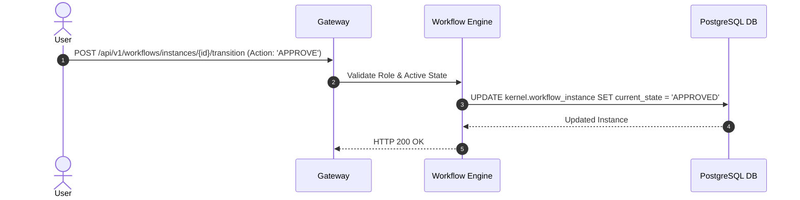

# Workflow Engine — Implementation Specification

## Version 1.0.0

---

## 1. Purpose
The Workflow Engine is the platform runtime service executing state machine workflows, state transitions, task assignments, SLA deadline monitoring, and escalation triggers across all business modules in HEMP.

---

## 2. Scope
Applies to Provider Credentialing, Prior Authorization Reviews, Claims Adjudication Disputes, and TPL Recovery Cases.

---

## 3. Business Context
State machine workflows automate complex multi-step approvals, enforcing role permissions and SLA compliance.

---

## 4. Functional Requirements
- **FR-WFE-01**: Declarative state machine workflow definition ingestion (`Draft -> Submit -> Review -> Approve -> Reject -> Escalate`).
- **FR-WFE-02**: Workflow instance creation and state transition execution.
- **FR-WFE-03**: Automated task assignment and SLA breach escalation dispatching.

---

## 5. Non-Functional Requirements
- **NFR-WFE-01**: State transition execution latency < 50ms.

---

## 6. Actors & Personas
- **Workflow Administrator**: Configures state transitions in JSON definitions.
- **Task Assignee**: Executes transition action in UI.

---

## 7. User Stories
- **US-WFE-01**: As a Supervisor, I want SLA breach tasks to escalate automatically to my queue after 48 hours of inactivity.

---

## 8. UI Specifications & Wireframe Descriptions
- **Screen WFE-UI-01 (Workflow State Action Bar Component)**:
  - *Wireframe*: Renders active state badge (`IN_REVIEW`) and available action buttons (`Approve`, `Reject`, `Escalate`).

---

## 9. Navigation & Breadcrumb Maps
```
Home
└── Tasks
    └── Pending Work Queue (Home / Tasks / Queue)
```

---

## 10. Business Rules
- `WFE-BR-01`: State transitions MUST verify the actor's role against `requiredRole` declared in `kernel.workflow_definition`.

---

## 11. Validation Rules & RegEx Contracts
- `workflowId`: Lowercase string (`^[a-z0-9._]+$`).

---

## 12. Workflow State Machine & Transitions
```
[INITIATED] ──(TRANSITION)──► [IN_PROGRESS] ──(COMPLETE)──► [COMPLETED]
```

---

## 13. Sequence Diagrams


---

## 14. Database Schema & DDL Links
Reference: [database/ddl/04_workflow.sql](file:///c:/Users/affra/Documents/ETS/Enterprise%20Healthcare%20Management%20Platform/database/ddl/04_workflow.sql)
Tables: `kernel.workflow_definition`, `kernel.workflow_instance`.

---

## 15. Complete Data Dictionary
| Table | Column | Data Type | Nullable | Description |
|-------|--------|-----------|----------|-------------|
| `kernel.workflow_instance` | `instance_id` | UUID | No | Primary Key |
| `kernel.workflow_instance` | `current_state` | VARCHAR(64) | No | Active Workflow State |

---

## 16. API Specifications
- `POST /api/v1/workflows/instances`: Start new workflow instance.
- `POST /api/v1/workflows/instances/{id}/transition`: Execute state transition.

---

## 17. Error Codes (RFC 7807 Compliant)
- `WFE-ERR-2001`: Invalid Transition Action for Current State (`422 Unprocessable`).

---

## 18. Security & RBAC Matrix
- State transitions check `requiredRole` against caller JWT claims.

---

## 19. Immutable Audit Logging Specs
- Logs `WORKFLOW_STARTED`, `STATE_TRANSITIONED`, `SLA_ESCALATED`.

---

## 20. Reporting & Dashboard Metrics
- Workflow Cycle Time SLA Aging Dashboard.

---

## 21. AI Metadata & Tool Registry
- `get_workflow_status(instanceId: string)`

---

## 22. Semantic Mapping & Text-to-SQL Catalog
- Business Definition: "Workflow state machines, active tasks, and SLA escalations."

---

## 23. Performance & Latency Targets
- State Transition Latency: < 50ms.

---

## 24. Test Cases & Acceptance Criteria
- `TC-WFE-001`: Executing valid transition updates `current_state` and writes audit log.

---

## 25. Acceptance Criteria Matrix
- Invalid transitions return `WFE-ERR-2001`.

---

## 26. Future Enhancements
- Visual BPMN 2.0 diagram import/export editor.

---

## 27. Cross References
- [08_Workflow_Engine.md](file:///c:/Users/affra/Documents/ETS/Enterprise%20Healthcare%20Management%20Platform/specifications/08_Workflow_Engine.md)

---

## 28. Revision History
- **v1.0.0** (2026-08-05): Production-Ready Implementation Specification release.
